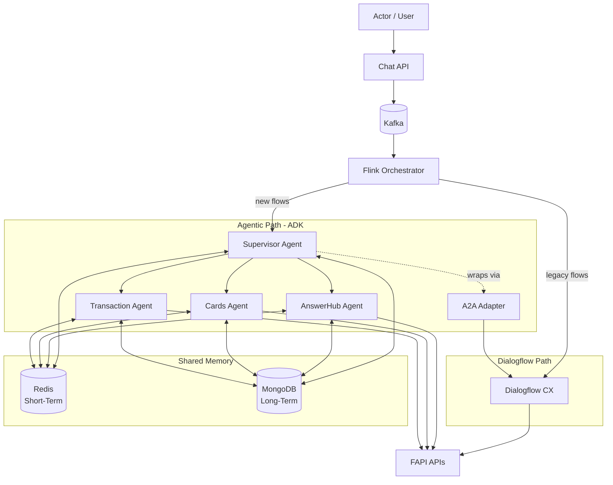
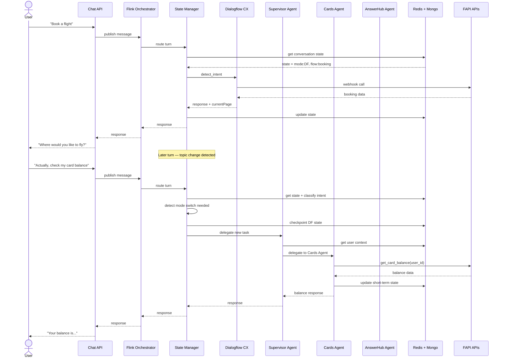
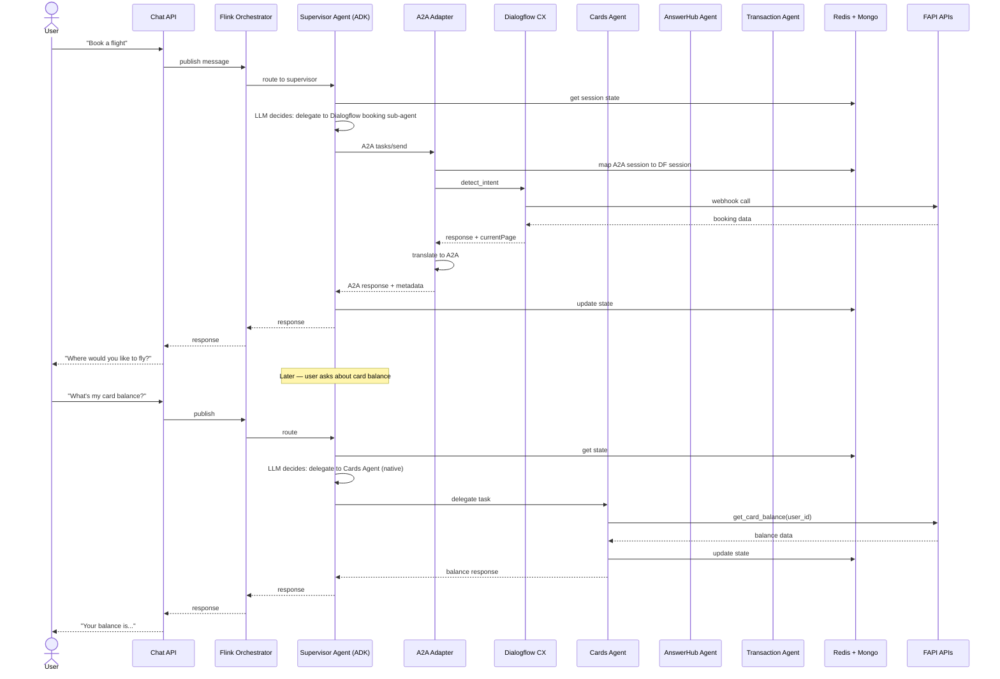
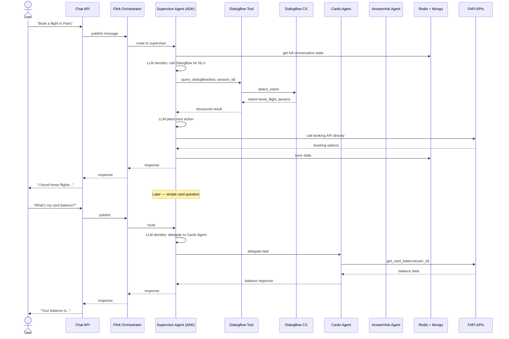
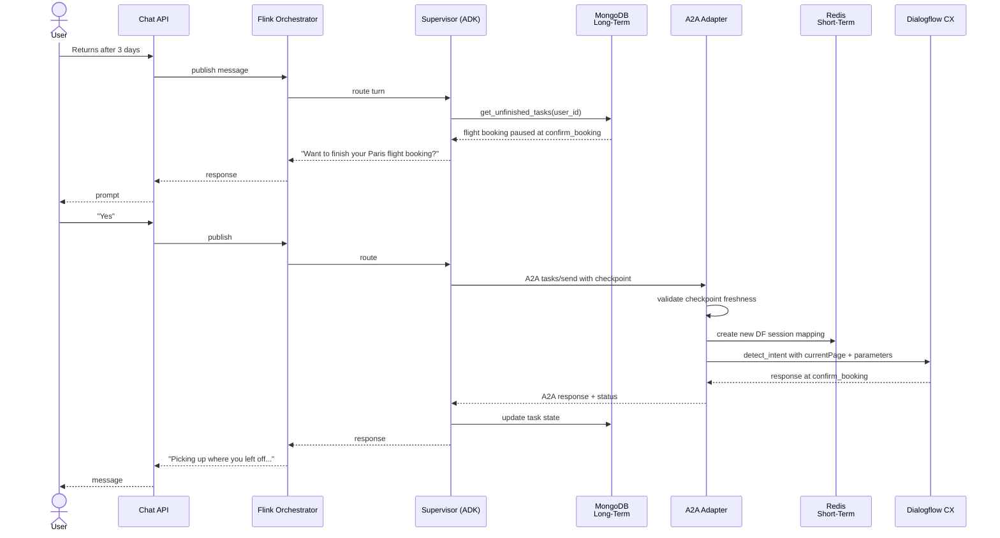

# Integrating Dialogflow CX Into an Agentic System

## Overview

This guide covers how to bring an existing Dialogflow CX agent into a modern agentic architecture built on ADK (Agent Development Kit) — how to wire it up under a supervisor, deal with the schema mismatch between Dialogflow and A2A, and design storage so users can pick up where they left off. It's aimed at teams who have working Dialogflow CX flows in production and want to migrate to an agentic system gradually without breaking what already works.

## Table of Contents

- [Overall System Architecture](#overall-system-architecture)
- [Three Ways to Integrate Dialogflow CX](#three-ways-to-integrate-dialogflow-cx)
- [Option Comparison and Recommendation](#option-comparison-and-recommendation)
- [The Schema Mismatch Between A2A and Dialogflow CX](#the-schema-mismatch-between-a2a-and-dialogflow-cx)
- [The A2A Adapter: What It Does and Where It Lives](#the-a2a-adapter-what-it-does-and-where-it-lives)
- [Session Storage and Task Storage](#session-storage-and-task-storage)
- [Does ADK's SessionService Replace This?](#does-adks-sessionservice-replace-this)
- [Using currentPage for Recovery](#using-currentpage-for-recovery)
- [Layered Memory for Resume-Where-You-Left-Off](#layered-memory-for-resume-where-you-left-off)
- [Key Concepts](#key-concepts)
- [Summary and Takeaways](#summary-and-takeaways)

---

## Overall System Architecture

Before getting into the integration patterns, here's the full system landscape. The actor talks to a Chat API. The Chat API publishes messages to Kafka, where a Flink-based orchestrator consumes them and decides whether to route to Dialogflow CX or the Supervisor Agent. The Supervisor has specialized sub-agents (AnswerHub, Cards Agent, Transaction Agent), each of which calls downstream FAPI APIs. Both the supervisor and sub-agents share memory tiers: Redis for short-term state and MongoDB for long-term user memory.



A few things to notice:

**Kafka + Flink decouples the Chat API from routing decisions.** The Chat API just publishes user messages. Flink consumes them, looks up state, and routes. This gives you a clean seam for gradual migration — you change Flink's routing rules as flows move from Dialogflow to the supervisor, and the Chat API doesn't need to know.

**The A2A adapter is optional.** If the supervisor needs to call legacy Dialogflow flows as a sub-agent (rather than Flink routing directly to Dialogflow), the adapter lets that happen cleanly. In pure "Flink routes to one or the other" designs, you can skip the adapter.

**Sub-agents share memory with the supervisor.** Redis for short-term working state, MongoDB for long-term user memory. Both layers are accessible to any agent that needs them, so context flows across the system.

**All agents (old and new) call FAPI APIs.** This keeps business logic in the API layer and means agents are just conversation orchestrators, not business logic containers.

---

## Three Ways to Integrate Dialogflow CX

There are three sensible patterns for putting Dialogflow CX alongside an agentic system. Each fits a different situation, and each has a distinct turn-level flow.

### Option 1: State Manager in Front of Both

A state manager sits at the very top, in front of both Dialogflow CX and the supervisor agent. It inspects each user turn, checks the current state (is the user mid-flow? new conversation? resuming?), and routes to one side or the other. This is a deterministic pre-routing layer — no LLM call required for the routing decision itself.

The state manager owns the top-level conversation state. It knows which "mode" the user is in (Dialogflow flow vs. agentic task) and can hand off between them based on explicit signals (flow completion, topic change detection, user intent shifts).



The state manager can be as simple or as smart as you want — keyword rules, a small classifier, or even a tiny LLM call. The key property is that it's **cheap and deterministic** for the common case, with explicit rules for mode-switching.

### Option 2: Dialogflow CX as a Sub-Agent Under ADK Supervisor

The ADK supervisor is the top-level brain. Dialogflow CX is registered as a sub-agent via the A2A adapter. The supervisor delegates whole conversation segments to it and gets back structured results.



Key thing to notice: from the supervisor's perspective, the Dialogflow sub-agent (via A2A adapter) and the native sub-agents (Cards, AnswerHub, Transaction) look the same. The supervisor just delegates. This is what makes migration smooth — as Dialogflow flows get retired, they're replaced with native ADK sub-agents and the supervisor contract doesn't change.

Dialogflow keeps owning its session while handling a flow, so no mid-flow state translation. As Dialogflow flows get retired, they're replaced by native ADK sub-agents under the same supervisor. The supervisor's contract doesn't change.

### Option 3: Dialogflow CX as a Tool Under ADK Supervisor

Dialogflow CX is wrapped as a stateless-looking tool that the supervisor calls per turn. The supervisor owns all conversation state and manages the entire flow itself.



Notice what's different here: the supervisor calls Dialogflow just for intent detection, then does all the orchestration itself — including calling FAPI APIs directly. Native sub-agents like Cards still work normally. The downside is Dialogflow's multi-turn value (slot-filling, page transitions, webhook flows) is essentially unused — you're treating it as a fancy intent classifier.

This treats Dialogflow as an NLU utility rather than a conversation owner. The supervisor re-derives flow position every turn from its own state. Breaks multi-turn Dialogflow flows — slot-filling, webhooks, and page transitions depend on session continuity that this pattern doesn't preserve.

### Example: Dialogflow CX as an ADK Sub-Agent (Native)

If you want to skip A2A entirely and use Dialogflow CX directly as a native ADK `BaseAgent`, the shape looks like this:

```python
from google.adk.agents import BaseAgent
from google.adk.events import Event
from google.cloud import dialogflowcx_v3 as cx
from google.genai import types
import uuid

class DialogflowCXSubAgent(BaseAgent):
    def __init__(self, name, project_id, location, agent_id):
        super().__init__(name=name)
        self.client = cx.SessionsClient()
        self.project_id = project_id
        self.location = location
        self.agent_id = agent_id

    async def _run_async_impl(self, ctx):
        user_text = extract_latest_user_text(ctx.session.events)

        # Use ADK state dict to hold the Dialogflow session ID
        df_session_id = ctx.session.state.get("df_session_id")
        if not df_session_id:
            df_session_id = f"df-sess-{uuid.uuid4()}"
            ctx.session.state["df_session_id"] = df_session_id

        session_path = self.client.session_path(
            self.project_id, self.location, self.agent_id, df_session_id
        )
        text_input = cx.TextInput(text=user_text)
        query_input = cx.QueryInput(text=text_input, language_code="en")

        response = self.client.detect_intent(
            request={"session": session_path, "query_input": query_input}
        )

        result = response.query_result
        # Persist currentPage for recovery
        ctx.session.state["df_current_page"] = result.current_page.display_name
        ctx.session.state["df_parameters"] = dict(result.parameters)

        text = result.response_messages[0].text.text[0] if result.response_messages else ""
        yield Event(
            author=self.name,
            content=types.Content(parts=[types.Part(text=text)])
        )
```

This is the simplest working integration when ADK is your only supervisor framework. No adapter, no A2A, no separate stores — ADK's `SessionService` holds everything.

---

## Option Comparison and Recommendation

### Option 1: State Manager in Front

**Good:** Existing Dialogflow flows keep running untouched. Routing is fast (milliseconds), cheap, and deterministic — no LLM call per turn just to decide where to send the message. Explicit and auditable, which matters in regulated industries. Migration is gradual: flip routing rules as flows move from Dialogflow to the supervisor. Framework-agnostic at the top — you're not locked into ADK for the state manager itself.

**Not good:** You're maintaining three systems (state manager, supervisor, Dialogflow). Handoff between Dialogflow and the supervisor is where most bugs will live — conversation state has to translate between two representations. The state manager's routing logic needs its own testing and monitoring. You're building orchestration ADK already provides.

**Fits when:** You have strict latency or cost constraints, need deterministic routing for compliance, or want to keep the top layer framework-agnostic.

### Option 2: Dialogflow CX as Sub-Agent Under ADK

**Good:** Dialogflow keeps owning its session while handling a flow, so no mid-flow state translation inside a conversation. ADK has first-class sub-agent support. Migration path is obvious — retire Dialogflow flows one at a time, replace each with a native ADK sub-agent, supervisor contract stays stable. LLM-based routing handles ambiguous cases better than deterministic rules.

**Not good:** Mid-flow interruption is awkward — if the supervisor delegates to Dialogflow and the user goes off-topic, pulling control back is non-trivial (Dialogflow wasn't designed to be interrupted). Every turn goes through the supervisor LLM first, adding latency (500ms–2s) and per-turn cost even for flows Dialogflow could've handled instantly. Two layers of state (supervisor's and Dialogflow's) need to stay in sync.

**Fits when:** You want to stay ADK-native, your existing flows are fairly self-contained (interruption is rare), and latency/cost aren't critical constraints.

### Option 3: Dialogflow CX as a Tool

**Good:** Simplest mental model. One source of truth for conversation history (the supervisor). Clean unit tests.

**Not good:** Breaks Dialogflow's multi-turn flows. Slot-filling, webhooks, and page transitions all depend on session continuity. Using Dialogflow as a stateless tool throws away its core value — you'd essentially be using it as an intent classifier, which is overkill. The worst fit for "I have existing flows and want to migrate gradually."

**Fits when:** Your Dialogflow usage is already mostly single-turn intent detection with minimal multi-turn logic.

### The Recommendation

For teams with existing Dialogflow CX flows migrating gradually to agentic:

**Start with Option 1 (State Manager in Front)** if you have meaningful production traffic on Dialogflow and want the safest, most controlled migration. You keep Dialogflow untouched, stand up the supervisor next to it, and move traffic flow-by-flow. This is the most forgiving pattern when things go wrong — a supervisor bug doesn't break your existing Dialogflow flows.

**Move to Option 2 (Sub-Agent Under ADK)** once enough flows have been migrated that the supervisor is the primary entry point. At that stage, the remaining Dialogflow flows become sub-agents under ADK and get retired over time.

**Skip Option 3** unless your Dialogflow usage is really just intent classification. It fights your existing investment.

A practical path: start with the state manager, migrate high-value flows to ADK native sub-agents, then when Dialogflow handles less than half the traffic, collapse the state manager into the supervisor and make remaining Dialogflow flows A2A sub-agents. You've done the migration without a big-bang cutover.

---

## The Schema Mismatch Between A2A and Dialogflow CX

When Dialogflow CX is a sub-agent in an A2A system, the two sides speak different languages. Neither can be changed, so you translate.

Dialogflow CX request and response:

```json
// Request
{
  "queryInput": {
    "text": {"text": "Book a flight to Paris"},
    "languageCode": "en"
  },
  "session": "projects/P/locations/L/agents/A/sessions/S"
}

// Response
{
  "queryResult": {
    "intent": {"displayName": "book_flight"},
    "parameters": {"destination": "Paris"},
    "currentPage": {"displayName": "collect_dates"},
    "responseMessages": [{"text": {"text": ["When would you like to fly?"]}}],
    "match": {"matchType": "INTENT"}
  }
}
```

A2A:

```json
// Task send
{
  "jsonrpc": "2.0",
  "method": "tasks/send",
  "params": {
    "id": "task-123",
    "sessionId": "session-456",
    "message": {
      "role": "user",
      "parts": [{"type": "text", "text": "Book a flight to Paris"}]
    }
  }
}

// Task response
{
  "result": {
    "id": "task-123",
    "status": {"state": "input-required | completed | working"},
    "artifacts": [{"parts": [{"type": "text", "text": "When would you like to fly?"}]}],
    "metadata": {}
  }
}
```

The mismatches fall into four buckets: message structure, session identity, state lifecycle, and capability advertisement. Fixing them is the adapter's job.

---

## The A2A Adapter: What It Does and Where It Lives

### Where It Sits

The adapter lives on the **sub-agent side**, not the supervisor side. It wraps Dialogflow CX and exposes an A2A-compliant interface to the outside world.

Deployment: a separate service (FastAPI or similar). It exposes:
- `/.well-known/agent.json` — the Agent Card advertising capabilities
- `/a2a` — the JSON-RPC endpoint for A2A methods

Rule of thumb: one adapter per non-A2A system you want to expose as a sub-agent. The supervisor stays clean and protocol-native.

### What the Adapter Does

Four jobs.

**1. Publishes an Agent Card.** A2A agents advertise at `/.well-known/agent.json`. Dialogflow has no such concept, so the adapter publishes one on its behalf. You can derive the `skills` list from Dialogflow CX's intents or flows programmatically.

```json
{
  "name": "dialogflow-booking-agent",
  "description": "Handles flight and hotel bookings via multi-turn dialog",
  "url": "https://adapter.example.com/a2a",
  "version": "1.0.0",
  "capabilities": {"streaming": false, "pushNotifications": false},
  "skills": [
    {
      "id": "book_flight",
      "name": "Flight Booking",
      "description": "Book flights with date, destination, passenger details",
      "tags": ["booking", "travel"]
    }
  ]
}
```

**2. Translates A2A requests to Dialogflow CX.** Extract text from A2A's multipart message, map A2A session ID to a Dialogflow session path, optionally inject user context as Dialogflow session parameters.

```python
def a2a_to_dialogflow(a2a_request):
    task_id = a2a_request["params"]["id"]
    session_id = a2a_request["params"]["sessionId"]

    text_parts = [
        p["text"] for p in a2a_request["params"]["message"]["parts"]
        if p["type"] == "text"
    ]
    user_text = " ".join(text_parts)

    df_session_id = session_store.get_or_create(session_id)
    df_session_path = (
        f"projects/{PROJECT}/locations/{LOCATION}"
        f"/agents/{AGENT_ID}/sessions/{df_session_id}"
    )

    return {
        "session": df_session_path,
        "queryInput": {
            "text": {"text": user_text},
            "languageCode": "en"
        }
    }
```

**3. Translates Dialogflow CX responses to A2A.** Harder because A2A has a richer task lifecycle (`submitted`, `working`, `input-required`, `completed`, `failed`, `canceled`) and Dialogflow doesn't emit explicit completion signals. You infer the state:

```python
def infer_task_state(query_result):
    current_page = query_result.get("currentPage", {}).get("displayName", "")

    if current_page in ("End Flow", "End Session"):
        return "completed"

    confidence = query_result.get("intentDetectionConfidence", 0)
    if confidence < 0.3 and not current_page:
        return "failed"

    if query_result.get("responseMessages"):
        return "input-required"

    return "working"
```

Design tip: build Dialogflow CX flows with explicit end pages (`booking_complete`, `booking_canceled`) so the adapter detects completion cleanly without guessing.

**4. Maps parameters to artifacts.** Filled slots (destination, dates, passenger count) should become A2A artifacts so the supervisor gets structured data, not just text:

```python
def build_artifacts(query_result):
    params = query_result.get("parameters", {})
    if not params:
        return []
    return [{
        "name": "extracted_parameters",
        "parts": [{"type": "data", "data": params}]
    }]
```

This is what makes Dialogflow genuinely useful as a sub-agent — the supervisor gets `{"destination": "Paris", "date": "2026-05-10"}` as structured output, not natural-language text it has to parse.

### Adapter Skeleton

```python
from fastapi import FastAPI
from google.cloud import dialogflowcx_v3 as cx

app = FastAPI()
session_store = SessionStore()
task_store = TaskStore()
df_client = cx.SessionsClient()

@app.get("/.well-known/agent.json")
async def agent_card():
    return generate_agent_card_from_dialogflow()

@app.post("/a2a")
async def handle_a2a(request: dict):
    method = request.get("method")
    if method == "tasks/send":
        return await handle_task_send(request)
    elif method == "tasks/get":
        return await handle_task_get(request)
    elif method == "tasks/cancel":
        return await handle_task_cancel(request)

async def handle_task_send(request):
    df_request = a2a_to_dialogflow(request)
    df_response = df_client.detect_intent(request=df_request)
    a2a_response = dialogflow_to_a2a(df_response, request["params"]["id"])
    await task_store.save(request["params"]["id"], a2a_response)
    return a2a_response
```

### Design Principles

Keep the adapter stateless where possible, stateful where necessary. Session mapping and task history need persistence; translation logic doesn't.

Make the A2A surface the contract, not Dialogflow. The supervisor should never know Dialogflow exists. Anything Dialogflow-specific (page names, intent names) goes in `metadata`, not core fields.

Design Dialogflow CX flows with adapter-friendliness in mind. Explicit end pages, consistent parameter naming, clean flow boundaries.

Version the adapter. When Google updates Dialogflow CX or the A2A spec evolves, you want one place to update.

---

## Session Storage and Task Storage

The adapter needs to remember two distinct things, with different shapes, lifetimes, and access patterns.

### Session Storage

**What it solves:** A2A session IDs and Dialogflow CX session IDs live in different spaces. When Turn 2 of a conversation arrives, the adapter needs to know which Dialogflow session it corresponds to so multi-turn state is preserved. Without this, every turn starts a fresh Dialogflow session and flows break.

**What it stores:**

```python
{
  "a2a_session_id": "user-abc-conv-123",
  "df_session_id": "df-sess-xyz",
  "created_at": "2026-04-18T10:00:00Z",
  "last_activity": "2026-04-18T10:05:23Z",
  "user_metadata": {"user_id": "u_456", "locale": "en-US"}
}
```

**Typical implementation:**

```python
class SessionStore:
    def get_or_create(self, a2a_session_id: str) -> str:
        existing = self.get(a2a_session_id)
        if existing and not self._is_expired(existing):
            self._touch(a2a_session_id)
            return existing["df_session_id"]

        df_session_id = f"df-sess-{uuid.uuid4()}"
        self.save(a2a_session_id, {
            "df_session_id": df_session_id,
            "created_at": now(),
            "last_activity": now()
        })
        return df_session_id

    def _is_expired(self, entry) -> bool:
        return (now() - entry["last_activity"]) > timedelta(minutes=30)
```

**Lifetime:** Short. Tied to Dialogflow CX's 30-minute session TTL. Redis with automatic TTL fits — the data is disposable and you want fast reads.

### Task Storage

**What it solves:** A2A is task-oriented. Every interaction is framed as a task with a lifecycle, and the supervisor can call `tasks/get`, `tasks/cancel`, or `tasks/sendSubscribe` at any time. Dialogflow has no concept of tasks. The adapter has to manufacture and maintain task state.

**What it stores:**

```python
{
  "task_id": "task-T1",
  "a2a_session_id": "user-abc-conv-123",
  "status": {
    "state": "input-required",
    "message": {
      "role": "agent",
      "parts": [{"type": "text", "text": "Where would you like to fly?"}]
    }
  },
  "history": [
    {
      "turn": 1,
      "user_message": "I want to book a flight",
      "agent_response": "Where would you like to fly?",
      "df_intent": "book_flight",
      "df_page": "collect_destination"
    }
  ],
  "artifacts": [],
  "metadata": {
    "intent": "book_flight",
    "currentPage": "collect_destination",
    "parameters": {}
  }
}
```

**Lifetime:** Longer. Retain tasks at least for the duration of the session (so `tasks/get` works), ideally hours to days for debugging, possibly longer for compliance. MongoDB fits here — flexible schema, fine for append-mostly task records, and it doubles as the long-term memory store in the overall system.

### How They Work Together

```python
async def handle_task_send(a2a_request):
    task_id = a2a_request["params"]["id"]
    a2a_session_id = a2a_request["params"]["sessionId"]
    user_text = extract_text(a2a_request)

    # Session Store: find or create Dialogflow session
    df_session_id = session_store.get_or_create(a2a_session_id)

    # Task Store: new task or continuation?
    existing_task = task_store.get(task_id)
    if not existing_task:
        task_store.save(task_id, {
            "task_id": task_id,
            "a2a_session_id": a2a_session_id,
            "status": {"state": "working"},
            "history": []
        })

    # Call Dialogflow CX
    df_response = df_client.detect_intent(
        session=build_session_path(df_session_id),
        query_input=build_query_input(user_text)
    )

    # Translate
    a2a_response = dialogflow_to_a2a(df_response, task_id)

    # Task Store: record turn and update status
    task_store.append_turn(task_id, {
        "user_message": user_text,
        "agent_response": extract_agent_text(a2a_response),
        "df_intent": df_response.query_result.intent.display_name,
        "df_page": df_response.query_result.current_page.display_name,
        "timestamp": now()
    })
    task_store.update_status(task_id, a2a_response["result"]["status"]["state"], ...)

    return a2a_response
```

`tasks/get` doesn't touch Dialogflow at all — the adapter answers from its task store. Dialogflow has no notion of task status, so the adapter is the source of truth.

### What Breaks If You Get It Wrong

No session store or a broken one: every turn starts fresh in Dialogflow, multi-turn flows break, users experience "the bot forgot what I just said."

No task store or a broken one: `tasks/get` returns nothing, no audit trail, streaming can't work, cancel operations have nothing to cancel.

Wrong TTL on session store: too short and mid-conversation sessions drop; too long and stale mappings point to dead Dialogflow sessions.

Wrong retention on task store: too short loses debugging; too long balloons storage costs and creates compliance risks.

### Storage Choices

| Use case | Session Store | Task Store |
|---|---|---|
| Dev/prototype | In-memory dict | In-memory dict |
| Small production | Redis with TTL | MongoDB |
| Scale production | Redis Cluster | MongoDB replica set / sharded |
| Regulated/audit-heavy | Redis (still) | MongoDB + cold archive to object storage |

Redis for sessions because it's cheap, fast, TTL-native, and the data is disposable. MongoDB for tasks because you need durability, queryability, flexible schema for evolving task metadata, and it aligns with the system's long-term memory store.

---

## Does ADK's SessionService Replace This?

Short answer: **partially**. ADK's SessionService covers the supervisor's concerns well but doesn't eliminate the adapter's storage needs. There's nuance worth understanding.

### What ADK SessionService Gives You

ADK has a built-in `SessionService` with multiple backends: `InMemorySessionService` for dev, `DatabaseSessionService` for SQL-backed production, and `VertexAiSessionService` for managed hosting on Vertex AI Agent Engine.

Per session it stores:

```python
Session(
    id="session-abc",
    app_name="booking-app",
    user_id="user-123",
    state={...},          # shared state dict
    events=[...],         # full event history
    last_update_time=...
)
```

You get conversation history, a shared state dict that sub-agents and tools can read/write, persistence across requests, and multi-user indexing. Genuinely useful.

### The Crucial Distinction

**ADK's session is the supervisor's view of the conversation. Dialogflow CX's session is its own internal state.** They're different things. ADK can't see inside Dialogflow, and Dialogflow can't see inside ADK. So there's still a mapping problem between the two.

### What's Covered vs. Not

| Need | ADK SessionService covers it? |
|---|---|
| Supervisor conversation history | Yes, fully |
| Shared state between supervisor and sub-agents | Yes, via `state` dict |
| A2A task lifecycle | Partial — not A2A-native but modelable |
| A2A-session-ID to Dialogflow-session-ID mapping | No — lives in the adapter |
| Dialogflow CX multi-turn page/slot state | No — lives in Dialogflow |
| A2A-shaped audit trail for compliance | Partial — events exist, but not A2A-shaped |

### Should You Stuff the Dialogflow Session ID Into ADK's State Dict?

Tempting but usually no. Three reasons:

The adapter should be a self-sufficient service that exposes A2A. If it reaches into ADK's session store, you've coupled your adapter to a specific supervisor framework. Tomorrow you might want a non-ADK supervisor to use this adapter — don't break that.

The adapter writes to its store on every turn. Giving it write access to the supervisor's database is a leaky abstraction.

ADK session lifetime is tied to supervisor conversations. Adapter session mappings are tied to Dialogflow's 30-minute TTL. Mixing them means reasoning about both lifecycles in one place.

### When You Don't Need A2A At All

If your Dialogflow sub-agent is **only ever used by an ADK supervisor** and will never be exposed to other systems, skip A2A entirely. Write a native ADK `BaseAgent` that wraps Dialogflow CX directly (see the example in [Three Ways to Integrate Dialogflow CX](#three-ways-to-integrate-dialogflow-cx)).

Trade-off: other agents can't talk to your Dialogflow sub-agent without going through ADK, and switching supervisor frameworks later is harder.

### Decision Matrix

| Scenario | Recommendation |
|---|---|
| ADK is your only supervisor, forever | Native ADK `BaseAgent`, use ADK's `state` for the DF session ID, skip A2A entirely |
| Dialogflow sub-agent might be called by other supervisors | Keep the A2A adapter with its own lean store |
| Hedging on framework choice | Build the A2A adapter, worth the portability |
| Regulated industry with strict audit | A2A adapter with dedicated task store for A2A-shaped records |

---

## Using currentPage for Recovery

Dialogflow CX's `currentPage` field is one of the most valuable pieces of metadata it returns, and it unlocks recovery patterns that are hard to build otherwise.

### Why It Matters

Unlike intent (per-turn) or parameters (potentially partial), the page is a durable pointer to conversation state. If you know the page, you know which flow you're in, which slots have been filled (implicitly), what the next expected input is, and where to resume if something breaks.

This matters because Dialogflow CX sessions are fragile — 30-minute TTL, server-side state you don't control. But `currentPage` lets you reconstruct position even after session loss.

### Recovery Patterns It Enables

**Session recovery after expiry.** User walks away for 45 minutes, comes back, Dialogflow session is gone. Without `currentPage` you restart the flow. With it:

```python
async def handle_task_send(request):
    a2a_session_id = request["params"]["sessionId"]
    mapping = session_store.get(a2a_session_id)

    if mapping and session_expired(mapping):
        last_page = mapping["last_page"]
        last_params = mapping["last_parameters"]

        # Fresh DF session, jump directly to last known page
        df_session_id = create_new_df_session()
        df_response = df_client.detect_intent(
            session=build_session_path(df_session_id),
            query_input=cx.QueryInput(
                event=cx.EventInput(event="resume_flow"),
                language_code="en"
            ),
            query_params=cx.QueryParameters(
                current_page=f"projects/.../pages/{last_page}",
                parameters=last_params
            )
        )
```

Dialogflow CX supports setting `currentPage` in the request — this is how you teleport into the middle of a flow.

**Retry on webhook failure.** If a webhook fails during a transition, the page tells you where to retry:

```python
def handle_webhook_failure(task_id, df_response):
    failed_page = df_response.query_result.current_page.display_name
    task_store.update(task_id, {
        "status": {"state": "failed", "error": "webhook_timeout"},
        "recovery": {
            "retry_from_page": failed_page,
            "retry_parameters": dict(df_response.query_result.parameters)
        }
    })
```

**Supervisor-level routing decisions.** Expose the page via A2A metadata so the supervisor can make informed interruption decisions:

```python
return {
    "result": {
        "status": {"state": "input-required"},
        "metadata": {
            "currentPage": "collect_destination",
            "flowName": "flight_booking",
            "filledParameters": {"intent": "book_flight"},
            "resumable": True
        }
    }
}
```

The supervisor can reason: *"User changed topic. Is the current page interruptible? If so, save the page and switch sub-agents."*

**Replayable debugging.** Because `currentPage` + `parameters` is a serializable snapshot, you can reproduce any failure in a test environment.

### Integration Into the Adapter

Update stores to persist page state on every turn:

```python
async def handle_task_send(request):
    # ... call Dialogflow CX ...
    query_result = df_response.query_result

    session_store.update(a2a_session_id, {
        "df_session_id": df_session_id,
        "last_page": query_result.current_page.display_name,
        "last_page_path": query_result.current_page.name,
        "last_parameters": dict(query_result.parameters),
        "last_flow": extract_flow_from_page(query_result.current_page.name),
        "last_activity": now()
    })
```

Extra storage cost: a few dozen bytes per turn. Recovery capability: substantial.

### Gotchas

Jumping to arbitrary pages can break flow logic. If page B expects a webhook to have run during the A→B transition, teleporting straight to B skips that. Test recovery paths carefully.

Parameter validation may re-trigger. Some pages re-validate parameters on entry; restored parameters might fail validation if they're stale.

Not all pages are addressable by name alone. Dialogflow CX requires the full resource path for `currentPage` in requests. Store the full path, not just the display name.

Design flows with resumable vs. non-resumable pages tagged in your adapter's configuration. A payment confirmation page probably shouldn't be teleported into.

---

## Layered Memory for Resume-Where-You-Left-Off

Modern agentic systems typically have three memory tiers. Each answers a different question about "where were we?"

**Short-term (working memory):** Current turn context, active Dialogflow session, last few messages. TTL in minutes. Store: Redis. Answers: *"Are you still in the middle of something right now?"*

**Session memory (conversation memory):** Full conversation history, task state, page snapshots, filled parameters. TTL in hours to days. Store: MongoDB. Answers: *"What happened earlier today?"*

**Long-term (user memory):** User preferences, unfinished tasks across time, learned facts about the user. TTL permanent. Store: MongoDB (plus optional vector index for semantic recall). Answers: *"What unfinished business do you have from any past session?"*

### How currentPage Fits Each Layer

In **short-term**, when a user is in an active Dialogflow session, `currentPage` is already in memory and the session is still alive. Nothing special needed.

In **session memory**, when a user leaves mid-booking and returns 2 hours later, the Dialogflow session is gone but the last page and parameters are in your session store:

```python
{
  "session_id": "s-123",
  "user_id": "u-456",
  "status": "paused",
  "last_activity": "2026-04-18T10:15:00Z",
  "checkpoint": {
    "sub_agent": "dialogflow-booking",
    "flow": "flight_booking",
    "page": "collect_destination",
    "page_path": "projects/P/.../pages/collect_destination",
    "parameters": {"intent": "book_flight", "origin": "Bengaluru"},
    "last_message_to_user": "Where would you like to fly to?"
  }
}
```

When the user returns, the supervisor checks for paused sessions and offers to resume.

In **long-term memory**, a user who started a booking three days ago on mobile and comes back today on desktop can be proactively prompted:

> *"Welcome back! You had a flight to Paris on May 10 pending confirmation. Should we finish that, or start something new?"*

This is the experience that makes agentic systems feel magical rather than just functional.

### The Resume Flow



Mechanically, the resume looks like:

```python
async def resume_task(checkpoint):
    df_session_id = f"df-sess-{uuid.uuid4()}"

    session_store.save(checkpoint['a2a_session_id'], {
        "df_session_id": df_session_id,
        "resumed_from": checkpoint['page']
    })

    df_response = df_client.detect_intent(
        session=build_session_path(df_session_id),
        query_input=cx.QueryInput(
            event=cx.EventInput(event="resume_checkpoint"),
            language_code="en"
        ),
        query_params=cx.QueryParameters(
            current_page=checkpoint['page_path'],
            parameters=checkpoint['parameters']
        )
    )

    return {
        "message": f"Picking up where you left off. {extract_text(df_response)}",
        "state": "input-required"
    }
```

Your Dialogflow CX flow needs a `resume_checkpoint` event handler on relevant pages to welcome the user back gracefully.

### Patterns That Keep This Robust

**Write aggressively, promote thoughtfully.** Every turn updates Redis (cheap). Every page transition promotes to MongoDB session memory. Task abandonment (detected by a background job) promotes to long-term memory with an LLM-generated summary.

**Differentiate task states.** Not every paused task should be resumable forever:

```python
class TaskLifecycle:
    ACTIVE = "active"                # In Redis
    PAUSED_RECENT = "paused_recent"  # In MongoDB session memory, resumable directly
    PAUSED_STALE = "paused_stale"    # In MongoDB long-term, may need re-confirmation
    EXPIRED = "expired"              # Too old, treat as new
    COMPLETED = "completed"          # Done, archive only
    ABANDONED = "abandoned"          # User explicitly gave up
```

Business rules decide transitions. A flight booking paused 3 days ago probably needs re-verifying prices. A support ticket paused 3 days ago can resume cleanly.

**Supervisor arbitrates, sub-agents execute.** The supervisor owns resume logic, not the sub-agent. The Dialogflow adapter just knows how to teleport into a page when asked. The decision of whether, which, and how to resume is supervisor-level reasoning. This keeps sub-agents simple and gives users one coherent "continue" experience regardless of which sub-agent owns the paused work.

**User-facing resume UX.** Expose unfinished tasks to the user instead of making them remember:

```python
async def greet_returning_user(user_id):
    unfinished = long_term_memory.get_unfinished_tasks(user_id)
    if not unfinished:
        return "Welcome! How can I help?"

    if len(unfinished) == 1:
        t = unfinished[0]
        return f"Welcome back! Want to continue {t['summary']}?"

    options = "\n".join(f"- {t['summary']}" for t in unfinished)
    return f"Welcome back! You have a few things in progress:\n{options}"
```

### Where It Gets Tricky

**Stale data.** Parameters saved 3 days ago may be invalid today. Flight prices change, inventory moves, dates pass. Resume logic needs validation:

```python
async def resume_with_validation(checkpoint):
    validation = await validate_checkpoint(checkpoint)
    if validation.fully_valid:
        return await resume_task(checkpoint)
    elif validation.partially_valid:
        checkpoint['parameters'] = validation.valid_params
        return await resume_task(checkpoint, with_reverification=True)
    else:
        return "That booking has expired. Want to start fresh?"
```

**Multiple devices.** User starts on mobile, switches to desktop. Both might have live sessions. Long-term memory reconciles by `user_id` (not `session_id`), with latest-write-wins or explicit "you have an active session elsewhere" UX.

**Privacy and retention.** Long-term memory often holds sensitive data. Apply TTL policies per data category, support user-initiated deletion, encrypt at rest, tag for compliance (GDPR right-to-be-forgotten).

**Ambiguity.** User says "yes, continue." Continue what? If long-term memory has multiple unfinished tasks, the supervisor must disambiguate rather than guess. Silent guessing leads to "why did the bot just try to finish my hotel booking when I wanted the flight?" bugs.

### Why Page-Level Checkpoints Matter

Page-level checkpoints are the bridge between stateful legacy systems like Dialogflow CX and memory-rich agentic systems. Without them, you'd have to replay conversation history to reconstruct position — expensive and brittle. With them, you have a compact, serializable checkpoint each memory tier can hold efficiently.

The short version: layered memory plus `currentPage` turns Dialogflow CX from a "hope the session survives" dependency into a system with genuine checkpoint-and-resume semantics.

---

## Key Concepts

**A2A (Agent2Agent protocol):** A standard for agents to talk to each other using JSON-RPC, with task lifecycles (`submitted`, `working`, `input-required`, `completed`, `failed`, `canceled`) and capability advertisement via Agent Cards.

**Agent Card:** A JSON document at `/.well-known/agent.json` that tells other agents what this agent can do. Includes skills, capabilities, and endpoint URL.

**ADK (Agent Development Kit):** Google's framework for building agentic systems. Includes a supervisor/sub-agent pattern and a SessionService for managing conversation state.

**Dialogflow CX:** Google's conversational AI platform with explicit flows, pages, and parameters. State-machine-like behavior makes it a strong sub-agent.

**currentPage:** The page the Dialogflow CX conversation is currently on. A durable checkpoint you can save and teleport back into.

**Session (in A2A):** The supervisor's notion of a conversation. Has its own session ID space.

**Session (in Dialogflow CX):** Dialogflow's internal conversation state, with a 30-minute TTL. Has a different ID space than A2A sessions.

**Task (in A2A):** A unit of work the supervisor asks a sub-agent to do, with a defined lifecycle. Dialogflow has no task concept natively.

**Supervisor agent:** The top-level ADK agent that orchestrates sub-agents or tools.

**Sub-agent:** A specialized agent delegated to by the supervisor. Can be native ADK (AnswerHub, Cards, Transaction) or wrapped Dialogflow CX via A2A adapter.

**State Manager:** A deterministic top-level router that decides whether a turn goes to Dialogflow CX or to the supervisor. Not an agent itself — more like a switchboard.

**Flink orchestrator:** The stream-processing layer that consumes messages from Kafka and routes them to either Dialogflow CX or the supervisor based on routing rules.

**FAPI APIs:** Downstream business APIs that both Dialogflow (via webhooks) and sub-agents (via tool calls) invoke to execute actual business logic.

**Memory tiers:** Short-term (minutes, Redis), session (hours/days, MongoDB), long-term (permanent, MongoDB with optional vector index). Each answers a different "where were we?" question.

---

## Summary and Takeaways

- For teams with existing Dialogflow CX flows migrating gradually to agentic, **start with Option 1 (State Manager in Front)** for safety and control. Move to **Option 2 (Sub-Agent Under ADK)** once the supervisor handles most traffic. Skip **Option 3 (Tool)** unless your Dialogflow usage is really just intent detection.

- The system sits on **Chat API → Kafka → Flink → (Dialogflow CX or Supervisor)**. Flink's routing rules are where migration happens — update rules, not application code, as flows move.

- **The A2A adapter lives with the sub-agent**, not the supervisor. It's a separate FastAPI service that wraps Dialogflow CX and exposes an A2A interface.

- **Two kinds of storage in the adapter** serve different needs. Session storage (Redis, short TTL) maps A2A sessions to Dialogflow sessions. Task storage (MongoDB, longer retention) maintains A2A task lifecycle state Dialogflow doesn't provide natively.

- **ADK's SessionService covers supervisor-side state but not adapter-side mapping.** If you're only using ADK and never exposing the Dialogflow sub-agent to other systems, skip A2A entirely and write a native ADK `BaseAgent` — ADK's session state dict handles everything.

- **`currentPage` is the checkpoint that makes resumability possible.** Save it after every turn. It enables session recovery after expiry, retry on webhook failure, smarter supervisor interruption decisions, and replayable debugging.

- **Layered memory (Redis short-term, MongoDB session, MongoDB long-term) makes `currentPage` dramatically more valuable.** Short-term alone gets 30-minute resume. All three layers get true cross-session, cross-device "pick up where you left off" — the genuinely differentiated UX.

- **The supervisor owns resume logic, sub-agents just execute.** The Dialogflow adapter teleports into a page when told. The decision of whether, which task, and how to resume belongs to the supervisor, which has the full picture across all sub-agents.

- **Sub-agents (AnswerHub, Cards, Transaction) and Dialogflow CX all call FAPI APIs** for business logic. Agents are conversation orchestrators, not business logic containers — this separation is what makes the architecture sustainable as it grows.

- **Validate stale checkpoints before resuming.** Prices change, inventory moves, dates pass. Always check the checkpoint is still valid before resuming; fall back to asking the user if partial data has gone stale.
